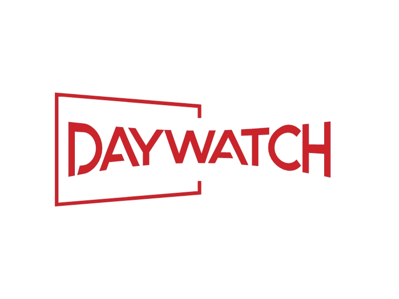

# DayWatch




[](https://github.com/yourusername/movie-series-streaming-app/blob/main/LICENSE)
[](https://flutter.dev/)
[](https://dart.dev/)


## Table of Contents

- [Description](#description)
- [Features](#features)
- [Prerequisites](#prerequisites)
- [Installation](#installation)
- [Usage](#usage)
- [Folder Structure](#folderstructure)
- [License](#license)


## Description

Welcome to DayWatch repository! A the Movie and Series Streaming App. This app, built using Flutter, allows users to stream and explore their favorite movies and series on-the-go. It integrates with The Movie Database (TMDB) API to provide up-to-date information about movies and series. Users can search, watch trailers, review, and manage their watchlist all in one place.

## Features

- User Authentication: Users can create accounts using their email and phone number, and log in securely.
- Subscription Plans: Users can choose from different subscription plans (daily, weekly, monthly) for accessing the content.
- Comprehensive Search: Users can search for movies and series by name, genre, release year, keywords, actors, and more.
- Watch Trailers: Users can watch trailers of movies and series directly in the app.
- Favorites and Watch History: Users can mark content as favorites and keep track of their watch history.
- TMDB Integration: The app integrates with The Movie Database to provide detailed information about movies and series.
- User Reviews: Users can read and write reviews for movies and series.
- Customizable Settings: Users can customize their app settings, including Wi-Fi-only mode.
- Responsive UI: The app offers a user-friendly and responsive user interface across different devices.

## Getting Started

### Prerequisites

Make sure you have the following installed:

- [Flutter](https://flutter.dev/docs/get-started/install)
- [Dart](https://dart.dev/get-dart)

### Installation

1. Clone this repository to your local machine.

```bash
git clone https://github.com/yourusername/movie-series-streaming-app.git
cd movie-series-streaming-app
```
2. Install Flutter and Dart on your system. Follow the official [Flutter installation guide](https://flutter.dev/docs/get-started/install) for detailed instructions.

3. Install the required dependencies by running:

```bash
flutter pub get
```

4. Create a TMDB API key by following the [TMDB API documentation](https://developers.themoviedb.org/3/getting-started/introduction


5. Create a `.env` file in the root directory and add your TMDB API key:

```dotenv
TMDB_API_KEY=your_tmdb_api_key
```


## Usage

1. Open the project in your preferred IDE or code editor.
2. Connect your device or use an emulator.
3. Run the app using the following command:

   ```
   flutter run
   ```

4. Explore the app, test its features, and provide feedback.


## Folder Structure

```plaintext
|-- lib/
|   |-- models/              # Data models
|   |-- screens/             # UI screens
|   |-- services/            # API services
|   |-- utils/               # Utility functions and constants
|-- assets/                  # App assets (images, fonts, etc.)
|-- test/                    # Unit and widget tests
|-- main.dart                # App entry point
```


## License

This project is licensed under the [MIT License](LICENSE).

## Contact

If you have any questions or suggestions, feel free to contact codewanda.ga@gmail.com.

Happy streaming!
